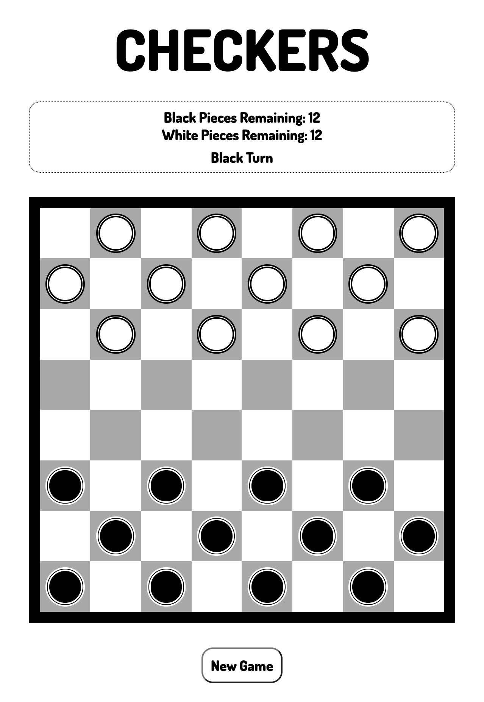

# Checkers

[Live Demo](https://yhussain8.github.io/checkers/)

My attempts at recreating the checkers board game as a static web application, using only vanilla HTML, CSS, and JavaScript. Specifically, this variant is known as American Checkers or English Draughts as played using an 8x8 grid.

### Rules of The Game

Check out to WikiHow's YouTube video on [How to Play Checkers](https://www.youtube.com/watch?v=MOW9k_C4vFU)

